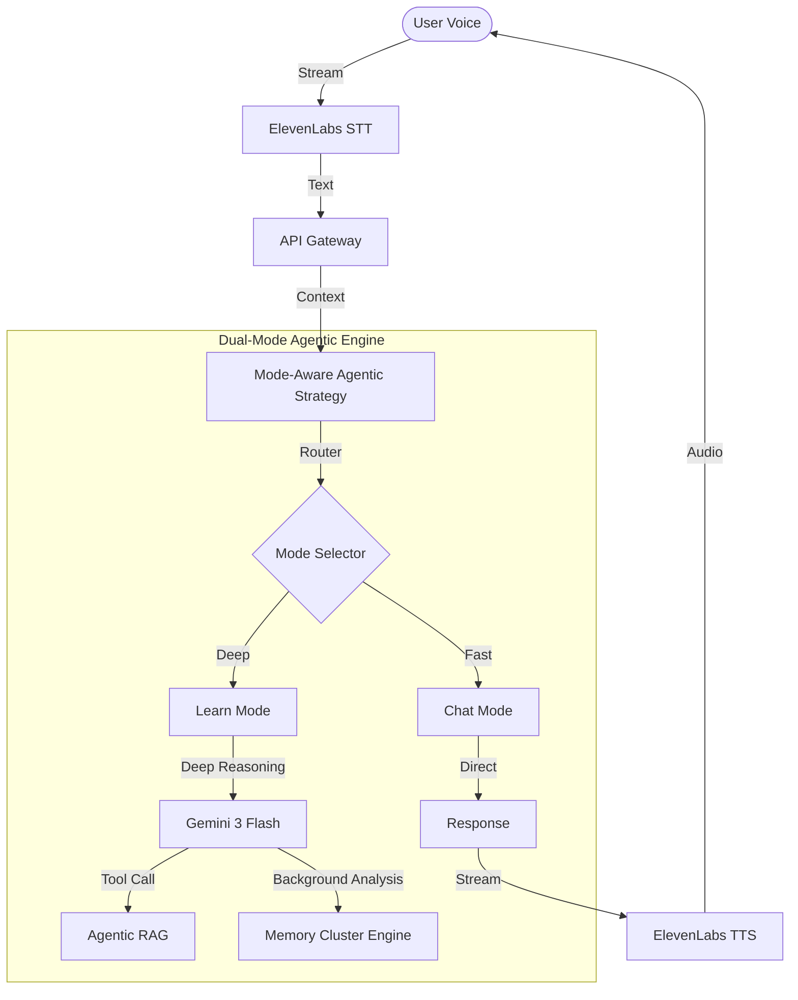

# Echo-Learn

> **Voice AI Study Partner** - A conversational learning system utilizing **Mode-Aware Agentic Architecture** and **Smart Memory Clusters** to simulate human-like tutoring.

## Overview

Echo-Learn is not just a chatbot; it's an **AI-powered cognitive tutor** that listens, reasons, and remembers. By integrating **ElevenLabs** for ultra-realistic voice, **Gemini 3** for deep reasoning, and a custom **Memory Cluster** engine, it creates a personalized learning experience that adapts to your retention curve.

## 🧠 Cognitive Architecture & Core Logic

Echo-Learn replicates human cognitive processes through two core technologies: **Mode-Aware Strategies** and **Smart Memory Clusters** (powered by Decay Algorithms).

### 1. High-Level Data Flow



### 2. Mode-Aware Agentic Strategy
*Implemented in `packages/agentic/src/strategies.ts`*

The system dynamically switches cognitive loads based on the interaction mode:

*   **Chat Mode (Fast Response)**: 
    *   **Behavior**: Low latency, direct response, conversational.
    *   **Logic**: Bypasses deep memory encoding. Used for casual conversation, quick facts, or "off-the-record" chat.
    *   **Tech**: Optimized for < 300ms TTFT (Time to First Token).

*   **Learn Mode (Deep Reasoning)**: 
    *   **Behavior**: Analytical, high-latency reasoning, memory-aware.
    *   **Logic**: Actively encodes new information, updates mastery scores, and runs background analysis to detect learning patterns.
    *   **Tech**: Utilizes **Gemini 3's** advanced reasoning capabilities to plan multi-step explanations and generate Socratic follow-up questions.

### 3. Smart Memory Cluster (Decay & Spaced Repetition)
*Implemented in `packages/storage/src/redis/mastery.ts`*

Unlike standard RAG, Echo-Learn utilizes a biologically inspired memory system that models human forgetting and reinforcement.

#### The Ebbinghaus Decay Algorithm
We simulate the **Forgetting Curve** to determine "Effective Mastery" of a topic over time. A student might master a topic today, but without reinforcement, that mastery decays following an exponential function.

$$
Effective Mastery = Stored Mastery \times e^{-\lambda \times \Delta t}
$$

*   **Code Implementation**:
    ```typescript
    const DECAY_RATE = 0.1; // λ
    const effectiveMastery = storedMastery * Math.exp(-DECAY_RATE * daysSinceInteraction);
    ```

#### SM-2 Spaced Repetition
Topics are scheduled for review using the industry-standard **SuperMemo-2 (SM-2)** algorithm. The system calculates the optimal `Next Review Date` based on:
*   **Streak Correct**: Consecutive correct answers.
*   **Ease Factor**: Complexity of the topic.
*   **Interval**: Days between reviews.

## 🌟 Unique Features

### 🔹 Gemini 3 Integration
Leveraging Google's distinct **Gemini 3** model, Echo-Learn achieves a level of reasoning previously essentially impossible in real-time voice apps. It processes multimodal inputs and handles complex instructional logic (e.g., "Explain this like I'm 5, then quiz me") with high fidelity.

### 🔹 ElevenLabs "Human" Interface
We don't just use TTS; we stream interactions. This allows for:
*   **Interruptibility**: Speak over the AI to change direction.
*   **Non-verbal cues**: The system detects pauses and intonation (planned).
*   **Ultra-low latency**: Streaming architecture ensures conversation feels natural, not turn-based.

### 🔹 Passive Learning Analysis
While you chat, a background process (`packages/agentic/src/modes/learn-mode.ts`) silently analyzes your responses to build a **Knowledge Graph** of your expertise. You don't need to "tell" it you learned something; it figures it out.

## 🏗️ Project Structure

```bash
echo-learn/
├── apps/
│   ├── web/                    # TanStack Start (React 19 + Vite 7)
│   └── server/                 # Hono.js Backend (Deep Knowledge API)
│
├── packages/
│   ├── agentic/                # 🧠 The BRAIN (Strategies, Modes, Gemini Ops)
│   ├── storage/                # 💾 The MEMORY (Redis Mastery, Vector Store)
│   ├── graph/                  # 🕸️ The KNOWLEDGE (Graph Gen & Walking)
│   ├── rag/                    # 📚 Retrieval Engine (Chunking, Ingest)
│   ├── llm/                    # 🤖 Model Wrappers & Prompts
│   ├── tool-ui/                # 🧩 Shared React Components (Assistant UI)
│   ├── gcs/                    # ☁️ Google Cloud Storage Helpers
│   ├── ingest/                 # 📄 Document Processing Pipelines
│   └── elevenlabs/             # 🗣️ Voice Integration Logic
│
└── doc/                        # Detailed Architectural Specs
```

## 💻 Technology Stack

### Frontend (Modern Stack)
*   **Framework**: [TanStack Start](https://tanstack.com/start) (Server-Side Rendering)
*   **Core**: [React 19](https://react.dev/) + [Vite 7](https://vitejs.dev/)
*   **Styling**: [Tailwind CSS v4](https://tailwindcss.com/)
*   **Primitives**: [Assistant UI](https://www.assistantui.com/), [Radix UI](https://www.radix-ui.com/)
*   **Visuals**: [Three.js](https://threejs.org/) (via R3F)

### Backend & AI
*   **Runtime**: [Bun](https://bun.sh/)
*   **API Framework**: [Hono.js](https://hono.dev/)
*   **Cognitive Engine**: [Google Gemini 3 Flash](https://deepmind.google/technologies/gemini/)
*   **Voice Pipeline**: [ElevenLabs React SDK](https://elevenlabs.io/docs/api-reference/react-sdk)

### Data Infrastructure
*   **Hot Memory**: [Upstash Redis](https://upstash.com/) (Session State, Mastery Scores)
*   **Knowledge Base**: [Upstash Vector](https://upstash.com/vector) (RAG Embeddings)
*   **Storage**: Google Cloud Storage

## Getting Started

### Prerequisites
*   Bun v1.0+
*   Keys for: Google Gemini, ElevenLabs, Upstash
*   Google Cloud Service Account

### Installation
1.  **Clone**: `git clone https://github.com/your-org/echo-learn.git`
2.  **Install**: `bun install`
3.  **Setup**: `cp .env.example .env` (Fill in keys)
4.  **Run**: `bun run dev`

### License
MIT